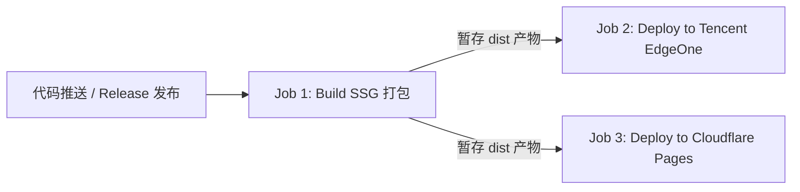

# Glow Prow 闪耀船首 - 前端技术栈与架构文档

> **项目名称**：`glow-prow-front` (Glow Prow 闪耀船首)  
> **项目定位**：《碧海黑帆 (Skull and Bones)》全能游戏百科、互动地图与配装模拟工具集前端 Web 应用  
> **文档路径**：[`docs/ARCHITECTURE.md`](/docs/ARCHITECTURE.md)

---

## 目录
- [一、核心设计理念 (Design Philosophy)](#一核心设计理念-design-philosophy)
- [二、核心技术栈 (Tech Stack)](#二核心技术栈-tech-stack)
- [三、核心技术要点 (Technical Key Points)](#三核心技术要点-technical-key-points)
- [四、项目整体目录结构 (Directory Structure)](#四项目整体目录结构-directory-structure)
- [五、核心模块与分层设计 (Architecture & Modules)](#五核心模块与分层设计-architecture--modules)
- [六、CI/CD 与多平台部署体系 (DevOps & Deployment)](#六cicd-与多平台部署体系-devops--deployment)

---

## 一、核心设计理念 (Design Philosophy)

### 1. 玩家第一与沉浸感体验 (Gamer-Centric & Immersive UX)
- **视觉风格与微动效**：结合 Material Design 3 与深邃暗黑航海风格，提供流畅的过渡动画、骨架屏加载与高质感游戏美术质感。
- **全端响应式与离线韧性**：完美适配 PC 宽屏、平板与手机竖屏；通过 PWA 与 Service Worker 提供离线百科浏览能力。

### 2. 内容优先与极致 SEO (Content-First & SEO Dominance)
- **超大规模静态预渲染 (SSG)**：全站 6300+ 词条与图鉴页面在构建期静态化，首屏秒开，TTFB（第一字节时间）降至边缘 CDN 级别。
- **语义化与结构化元数据**：每种语言内置精准的 Schema.org JSON-LD 结构化数据，全面激活搜索引擎站内搜索框与富媒体摘要卡片。

### 3. 端侧计算与边缘赋能 (Client-First & Edge Compute)
- **去中心化业务运算**：复杂的船只配装属性计算、走私收益推演、图像比对识别均在浏览器端（结合 Web Worker 与 TensorFlow.js）执行，减轻后端负载并提供零延迟即时交互。
- **URL 状态无损编码**：通过 `lz-string` 将复杂的配装数据高压缩比打包至 URL Hash，实现跨平台“复制链接即分享”的无状态体验。

### 4. 国际化一等公民 (First-Class Multilingual Support)
- **路由级语言隔离**：采用 `/:lang(zh-CN|zh-TW|en-US)/...` 全局多语言动态路由，支持 URL Clean 规范与无刷新即时语言切换。

---

## 二、核心技术栈 (Tech Stack)

| 类别 | 技术 / 库 | 版本 | 说明 |
| :--- | :--- | :--- | :--- |
| **基础框架** | [Vue 3](https://vuejs.org/) | `^3.5.17` | 采用 Composition API、`<script setup>` 模式 |
| **开发语言** | [TypeScript](https://www.typescriptlang.org/) | `~5.8.3` | 全栈类型安全支持，结合 `vue-tsc` 严格类型校验 |
| **构建工具** | [Vite](https://vitejs.dev/) | `^7.0.4` | 下一代极速前端构建工具 |
| **静态生成 (SSG)** | [vite-ssg](https://github.com/antfu/vite-ssg) | `^28.3.0` | 支持 6300+ 动态路由的高性能预渲染，SEO 深度优化 |
| **UI 组件库** | [Vuetify 3](https://vuetifyjs.com/) | `^3.8.1` | Material Design 3 组件体系，支持深浅主题无缝切换 |
| **图标与字体** | Material Design Icons (`@mdi/font`, `@mdi/js`) | `^7.4.47` | 全量矢量图标体系支持 |
| **样式方案** | Less / CSS Variables | `^4.4.0` | 模块化样式分层、响应式布局与主题变量控制 |
| **状态管理** | [Pinia](https://pinia.vuejs.org/) | `^3.0.3` | 新一代 Vue 状态管理，搭配 `pinia-plugin-persistedstate` 本地持久化 |
| **路由系统** | [Vue Router](https://router.vuejs.org/) | `^4.5.1` | 采用 `/:lang/...` 全局多语言前缀动态路由架构 |
| **国际化 (i18n)** | [Vue I18n](https://vue-i18n.intlify.dev/) | `^9.14.5` | 支持 `zh-CN`、`zh-TW`、`en-US` 三语言无缝切换 |
| **地理地图** | [OpenLayers](https://openlayers.org/) (`ol`) | `^10.6.1` | 高性能瓦片交互地图，支持多图层标注、路径与区域计算 |
| **图形与可视化** | [D3.js](https://d3js.org/) (`d3`, `d3-sankey`), [OGL](https://github.com/oframe/ogl) | `^7.9.0` / `^1.0.11` | 数据流桑基图、WebGL 粒子与轻量图形渲染 |
| **AI / 图像处理** | TensorFlow.js, Transformers, Cropper.js, Pixelmatch | `^4.22.0` / `^2.17.2` | 浏览器端图像识别、以图搜图、截图裁剪与像素级差异对比 |
| **富文本编辑器** | [Tiptap 3](https://tiptap.dev/) | `^3.0.7` | Headless 模块化富文本创作器，用于社区装配分享与攻略 |
| **离线与 PWA** | `vite-plugin-pwa` | `^1.2.0` | 完整离线缓存、Service Worker 与多语言 WebManifest 规范 |
| **本地检索与压缩**| `flexsearch`, `lz-string` | `^0.8.212` / `^1.5.0` | 高性能全文搜索引擎与 URL 配装数据高压缩率编解码 |
| **专用业务数据包**| `glow-prow-data`, `glow-prow-assets` | GitHub 仓库依赖 | 核心百科数据字典、地图瓦片与多语言翻译源数据 |

---

## 三、核心技术要点 (Technical Key Points)

### 1. 深度多语言路由体系 (`/:lang/...`)
- **路由前缀全映射**：所有业务路由通过 `createLocalizedRoutes()` 自动映射为 `/:lang(zh-CN|zh-TW|en-US)/...` 格式。
- **智能语言嗅探与兜底**：通过全局路由守卫（`beforeEach`），自动从 `localStorage`、浏览器 `navigator.language` 嗅探首选语言并补全前缀。
- **首屏秒级重定向**：在 `public/assets/lang-redirect.js` 注入微型静态脚本，纯静态首页在浏览器渲染前即可完成 URL 重定向。

### 2. 超大规模 SSG 预渲染与内存防爆优化 (6300+ 路由)
- **JSDOM 内存泄漏治理**：针对 `vite-ssg` 未主动释放 JSDOM 实例的问题，通过 [`scripts/patch-vite-ssg.js`](/scripts/patch-vite-ssg.js) 在 `npm install` 阶段自动植入 `jsdom.window.close()` 补丁，回收 DOM 树和事件队列。
- **主动垃圾回收调度**：构建命令开启 `NODE_OPTIONS='--expose-gc --max-old-space-size=7168'`，在 `onPageRendered` 钩子中每 10 页周期性执行 `global.gc()`，防止 V8 堆内存溢出。
- **样式内联剥离**：在构建时自动将重复内联的 350+ 行 Vuetify 主题样式替换为外部静态文件引用，单个 HTML 文件精简约 40%。

### 3. 地理空间与 OpenLayers 高性能瓦片地图 (`views/map`)
- 自建游戏全海域切片地图服务，集成坐标标注、航海路线测距、区域据点高亮与多层级缩放交互。

### 4. 浏览器端 AI 图像特征提取与以图搜图 (`views/search`)
- 基于 `@tensorflow/tfjs` 与 MobileNet 模型，在本地提取玩家上传截图的图像特征向量，实现毫秒级快速匹配游戏物品。

---

## 四、项目整体目录结构 (Directory Structure)

```text
glow-prow-main/
├── .github/                      # GitHub 配置与 CI/CD 流水线
│   └── workflows/
│       └── deploy.yml            # 自动化 SSG 构建 ➡️ EdgeOne & Cloudflare Pages 并行部署
├── docs/                         # 项目文档目录
│   └── ARCHITECTURE.md           # 前端技术架构与结构说明文档
├── public/                       # 静态公共资源目录 (打包时原样输出至 dist)
│   ├── assets/                   # 公共脚本 (analytics.js, lang-redirect.js 等)
│   ├── edgeone.json              # 腾讯云 EdgeOne Pages 路由配置 (CleanUrls、重写规则等)
│   ├── manifest.*.webmanifest    # 多语言 PWA 独立配置文件
│   ├── favicon.ico / favicon.png # 网站图标
│   └── robots.txt / ads.txt      # 搜索引擎与广告校验文件
├── router/                       # 路由核心配置
│   └── index.ts                  # 多语言路由生成、守卫 (前缀补全/存储同步)、平滑滚动控制
├── scripts/                      # 构建与辅助脚本
│   └── patch-vite-ssg.js         # vite-ssg JSDOM 内存释放补丁 (postinstall 自动触发)
├── src/                          # 应用源代码核心
│   ├── App.vue                   # 根组件 (布局骨架、全局通知、弹窗、多语言切换响应)
│   ├── main.ts                   # 应用入口 (SSG 启动、Vuetify/Pinia/i18n 挂载、SSR 环境垫片)
│   ├── vuetify.ts                # Vuetify 主题、色彩系统、组件默认配置
│   ├── assets/                   # 项目内部静态资源与通用工具库
│   │   ├── images/               # 矢量与位图静态图标
│   │   ├── sripts/               # 核心业务逻辑 (API 客户端、地图算法、走私收益、错误捕获)
│   │   └── styles/               # 全局 Less 样式表 (root.less, typography 等)
│   ├── components/               # 通用全局组件 (弹窗、评论框、图片裁剪、i18n 选择器等)
│   ├── config/                   # 应用业务配置字典
│   │   ├── languages.ts          # 多语言核心配置 (支持语言列表、默认语言、匹配规则)
│   │   ├── structuredData.ts     # Schema.org JSON-LD 结构化数据 (SEO 专用)
│   │   ├── ad.ts / privilege.json# 广告规则、权限与订阅配置
│   │   └── shipsConfig.json      # 船只参数与配装规则预设
│   ├── i18n/                     # 国际化系统初始化与资源加载
│   │   └── index.ts              # vue-i18n 实例构建、动态消息源加载
│   ├── lang/                     # 国际化语言包 (zh-CN, zh-TW, en-US)
│   ├── views/                    # 业务页面 (按功能模块划分，见下文)
│   ├── widgets/                  # 独立小部件系统 (可作为 iframe 或轻量微组件嵌入)
│   └── workers/                  # Web Worker 线程 (复杂图像处理、TensorFlow、耗时计算)
├── stores/                       # Pinia 状态仓库集合 (按业务领域划分)
│   ├── appStore.ts               # 应用全局状态 (主题、侧边栏、全局弹窗、网络状态)
│   ├── userAccountStore.ts       # 用户鉴权、登录、资料与权限状态
│   ├── assetsStore.ts            # 游戏物品、材料、图鉴字典缓存
│   ├── calculatorStore.ts        # 走私收益、黑市八里亚尔与银币计算器
│   ├── reminderStore.ts          # 游戏世界事件、BOSS、工单倒计时提醒
│   ├── stateOfWarStore.ts        # 赛季战争局势、领地势力图与工会排行
│   └── wishlistStore.ts          # 玩家愿望单与材料需求清单
├── package.json                  # 依赖描述、构建指令 (build:ssg, postinstall 等)
├── tsconfig.json                 # TypeScript 编译配置
└── vite.config.ts                # Vite 与 vite-ssg 打包配置、Sitemap 生成、资源分包
```

---

## 五、核心模块与分层设计 (Architecture & Modules)

```mermaid
graph TD
    User([浏览器 / 移动端 / PWA]) --> Router[Vue Router 4 (/:lang/ 动态多语言路由)]
    Router --> AppFrame[App.vue 核心框架]
    AppFrame --> Pinia[Pinia 状态中心]
    AppFrame --> Views[Views 业务视图模块]

    subgraph Views[业务功能视图 views/]
        V_Portal[Portal 门户/主页]
        V_Codex[Codex 全物品/船只/技能图鉴]
        V_Map[Map OpenLayers 交互大地图]
        V_Assembly[Assembly 船只装配模拟器]
        V_Calc[Calculator 收益与走私计算]
        V_War[StateOfWar 赛季战争与局势]
        V_User[User 用户中心/账号/收藏]
        V_Widgets[Widgets 独立可嵌入小部件]
    end

    subgraph DataLayer[数据持久化与支持层]
        LocalStore[(LocalStorage / PersistedState)]
        DataPack[glow-prow-data 游戏数据集]
        CDNStore[CDN 资源托管 & 离线缓存]
    end

    Pinia <--> LocalStore
    Views <--> DataPack
    Views <--> CDNStore
```

---

## 六、CI/CD 与多平台部署体系 (DevOps & Deployment)

项目在 [`.github/workflows/deploy.yml`](/.github/workflows/deploy.yml) 中实现了高度自动化的双轨部署体系：



### 1. 环境与触发策略
- **生产环境 (Production)**：
  - 发布 GitHub Release (`published`) 或向 `main` 分支推送代码时自动触发，部署至 EdgeOne `production` 环境与 Cloudflare Pages `main` 分支。
- **预览环境 (Preview)**：
  - 向 `dev` 分支推送代码时触发，自动部署至 EdgeOne `preview` 环境与 Cloudflare Pages `dev` 分支。
- **手动调度 (`workflow_dispatch`)**：
  - 支持在 GitHub 控制台直接下拉选择部署目标环境（`production` / `preview`）。

### 2. CI 运行机 Swap 内存保障
- 流水线在第一步动态配置 **10GB Swap 虚拟内存**，彻底消除 6300+ 页面大规模预渲染时的 Linux OOM-Killer 风险。
